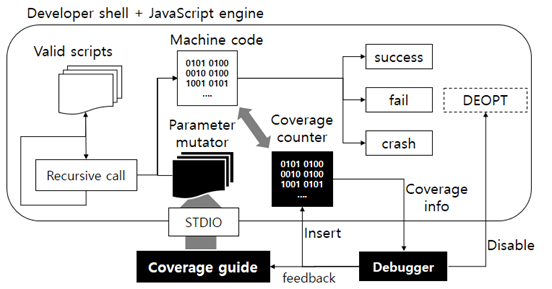

# jitfuzzer

# Introduction

Fuzzing tool for JavaScript functions JIT compiled by V8

Enables repeated testing of the same JIT code by hooking the deoptimization process that occurs when an assumption fails. Perform repeated tests and insert a machine language code into memory to measure test coverage and guide increased coverage.

# Test

This fuzzer is made for personal experiment aginst specific version of v8. To test with this code, you need a debug-built v8 and d8 binary on your machine. And also have to configure the path of d8 and debug information to insert breakpoint. This configurations are in d8_debug_configs.py. I tested it with following comit of v8.

[https://github.com/v8/v8/commit/8e8dbd379d689d352f61d814ddc71740c728ddfc](https://github.com/v8/v8/commit/8e8dbd379d689d352f61d814ddc71740c728ddfc)

After profer configuration, you can run the fuzzer excuting exp.py.

# TBD

- Global Code Refactoring
- Delete unnecessary prints.
- Packaging some files